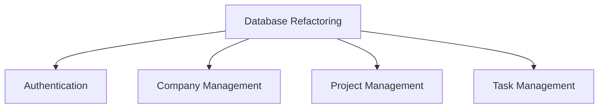
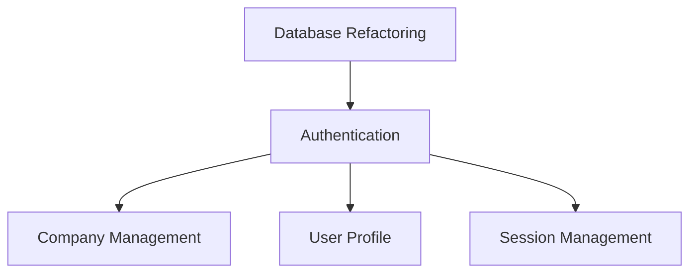
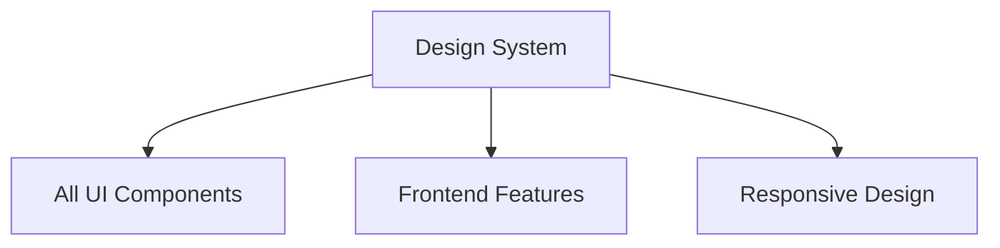
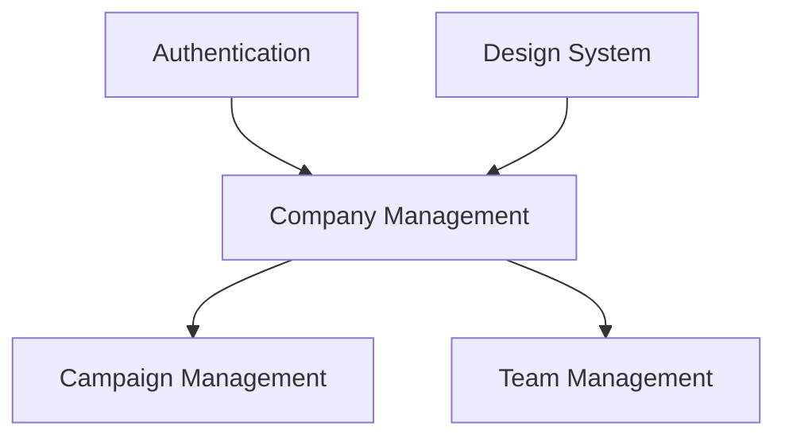
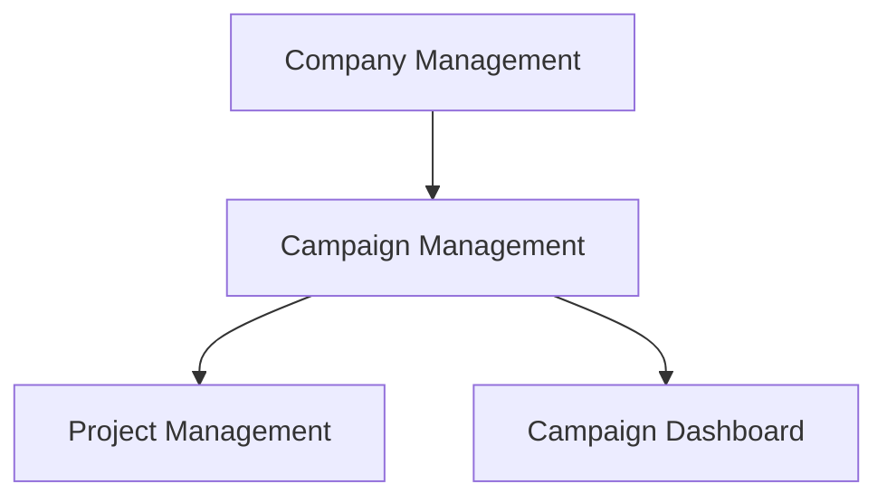
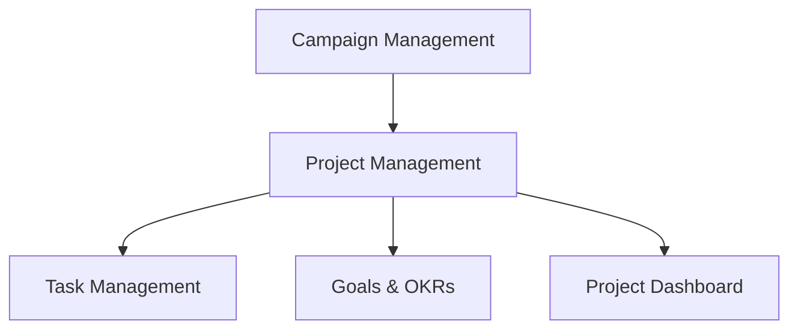
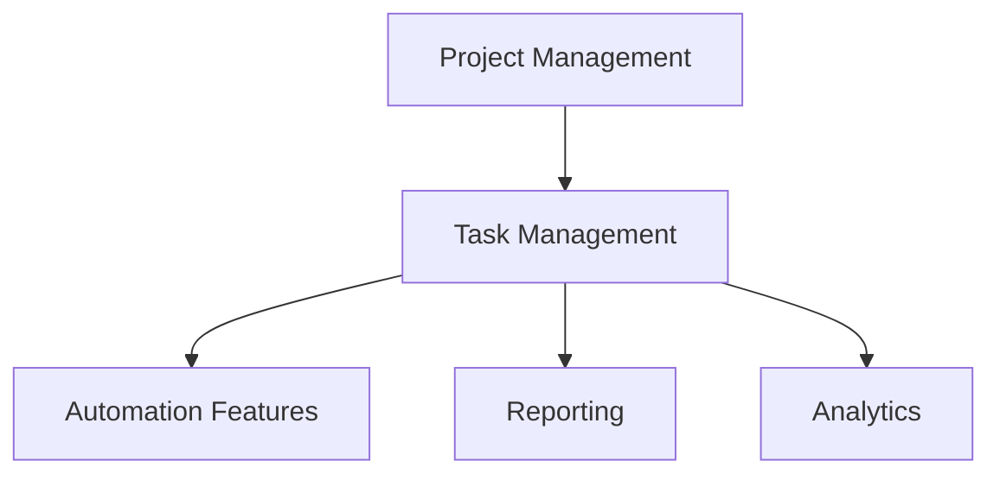

# FH Portal Dependency Mapping

## Overview
This document provides comprehensive dependency mapping for the FH Portal MVP, covering feature dependencies, technical dependencies, development workflow dependencies, and critical path analysis.

## Feature Dependency Hierarchy

### Level 0: Foundation (No Dependencies)
These features have no dependencies and can be started immediately.

#### 1. Database Refactoring (NEW)
**Dependencies**: None
**Enables**: All other features
**Critical Path**: Yes
**Timeline**: Week 1
**Status**: Required due to existing Frontend Horizon database conflicts



#### 2. Authentication & User Management (MODIFIED)
**Dependencies**: Database Refactoring (Level 0)
**Enables**: All other features
**Critical Path**: Yes
**Timeline**: Week 2
**Changes**: Integrate with existing users table instead of creating new



#### 3. Design System Implementation
**Dependencies**: None (can be parallel with database work)
**Enables**: All UI features
**Critical Path**: Yes
**Timeline**: Week 1-2 (parallel development)



### Level 1: Core Infrastructure (Depends on Level 0)
These features depend on authentication and design system.

#### 3. Company Management
**Dependencies**: 
- Authentication & User Management
- Design System Implementation
**Enables**: Campaign Management, Team Management
**Critical Path**: Yes
**Timeline**: Week 3



### Level 2: Business Logic (Depends on Level 1)
These features depend on company management being established.

#### 4. Campaign Management
**Dependencies**:
- Company Management (Level 1)
- Authentication & User Management (Level 0)
- Design System Implementation (Level 0)
**Enables**: Project Management
**Critical Path**: Yes
**Timeline**: Week 4



### Level 3: Project Layer (Depends on Level 2)
These features depend on campaign management.

#### 5. Project Management
**Dependencies**:
- Campaign Management (Level 2)
- Company Management (Level 1)
- Authentication & User Management (Level 0)
**Enables**: Task Management, Goals & OKRs
**Critical Path**: Yes
**Timeline**: Week 5



### Level 4: Execution Layer (Depends on Level 3)
These features depend on project management.

#### 6. Task Management
**Dependencies**:
- Project Management (Level 3)
- Campaign Management (Level 2)
- Company Management (Level 1)
- Authentication & User Management (Level 0)
**Enables**: Advanced features, Automation
**Critical Path**: Yes
**Timeline**: Week 6



### Level 5: Interface & Experience (Depends on All Core Features)
These features depend on all core business logic being complete.

#### 7. Apple-Style Card Interface
**Dependencies**:
- All core features (Levels 0-4)
- Design System Implementation (Level 0)
**Enables**: Enhanced UX, Mobile Experience
**Critical Path**: Yes
**Timeline**: Week 8

#### 8. Basic Dashboard
**Dependencies**:
- All core features (Levels 0-4)
- Apple-Style Card Interface (Level 5)
**Enables**: Analytics, Reporting
**Critical Path**: No
**Timeline**: Week 9

#### 9. Search & Filtering
**Dependencies**:
- All core features (Levels 0-4)
- Apple-Style Card Interface (Level 5)
**Enables**: Advanced search, Data export
**Critical Path**: No
**Timeline**: Week 10

## Technical Dependency Matrix

### Infrastructure Dependencies
```
Component                 | Depends On                    | Enables
--------------------------|-------------------------------|------------------
Next.js Setup           | None                          | All frontend
Supabase Setup          | None                          | All backend
Tailwind CSS            | Next.js                       | All styling
shadcn/ui               | Tailwind CSS                  | UI components
TypeScript Config       | Next.js                       | Type safety
ESLint/Prettier         | Next.js                       | Code quality
GitHub Actions          | Repository                    | CI/CD
Vercel Deployment       | Next.js, GitHub              | Hosting
```

### Database Dependencies
```
Schema Component         | Depends On                    | Enables
--------------------------|-------------------------------|------------------
Users Table             | Supabase                      | Authentication
Companies Table         | Users Table                   | Multi-tenancy
User_Companies Table    | Users, Companies              | Team management
Campaigns Table         | Companies                     | Campaign features
Projects Table          | Campaigns                     | Project features
Tasks Table             | Projects                      | Task features
Goals Table             | Projects                      | Goal tracking
Actions Table           | Projects, Tasks               | Action items
```

### API Dependencies
```
API Endpoint            | Depends On                    | Enables
--------------------------|-------------------------------|------------------
/auth/*                 | Users schema                  | Authentication
/companies/*            | Auth, Companies schema        | Company CRUD
/campaigns/*            | Companies API                 | Campaign CRUD
/projects/*             | Campaigns API                 | Project CRUD
/tasks/*                | Projects API                  | Task CRUD
/search                 | All entity APIs               | Global search
/dashboard              | All entity APIs               | Dashboard data
```

### Frontend Component Dependencies
```
Component               | Depends On                    | Enables
--------------------------|-------------------------------|------------------
AuthProvider           | Auth API                      | Protected routes
CompanyProvider        | Companies API                 | Company context
Layout Components      | Design System                 | Page structure
Card Components        | Design System                 | Entity display
Form Components        | Design System, Validation     | Data input
Navigation Components  | Design System, Routing        | User navigation
Dashboard Components   | All APIs, Card Components     | Data visualization
```

## Development Workflow Dependencies

### Team Dependencies
```
Role                    | Depends On                    | Blocks
--------------------------|-------------------------------|------------------
Backend Developer       | Database schema design       | API development
Frontend Developer      | Design system, APIs           | UI implementation
UI/UX Designer          | User research, wireframes     | Visual design
QA Engineer             | Feature completion            | Testing
DevOps Engineer         | Code completion               | Deployment
Product Manager         | Stakeholder requirements      | Feature definition
```

### Skill Dependencies
```
Technology              | Required Skills               | Learning Path
--------------------------|-------------------------------|------------------
Next.js 14              | React, TypeScript             | 1-2 weeks
Supabase                | SQL, PostgreSQL, RLS         | 1 week
Tailwind CSS            | CSS, Responsive design        | 3-5 days
shadcn/ui               | React, Tailwind               | 2-3 days
TypeScript              | JavaScript, Type systems      | 1-2 weeks
Testing                 | Jest, React Testing Library   | 1 week
```

### Environment Dependencies
```
Environment             | Depends On                    | Required For
--------------------------|-------------------------------|------------------
Development             | Local setup                   | Feature development
Staging                 | Development, CI/CD            | Testing
Production              | Staging validation            | User access
Database (Dev)          | Supabase project              | Local development
Database (Prod)         | Production environment        | Live data
CDN                     | Production deployment         | Asset delivery
```

## Critical Path Analysis

### Primary Critical Path (12 weeks)
```
Week 1: Project Setup & Design System
  ↓
Week 2: Authentication System
  ↓
Week 3: Company Management
  ↓
Week 4: Campaign Management
  ↓
Week 5: Project Management
  ↓
Week 6: Task Management
  ↓
Week 7: Integration & Testing
  ↓
Week 8: Apple-Style Interface
  ↓
Week 9-10: Dashboard & Search (Parallel)
  ↓
Week 11-12: Testing & Launch
```

### Parallel Development Opportunities
```
Weeks 1-3: Design System + Authentication (Parallel)
Weeks 4-6: Backend APIs + Frontend Components (Parallel)
Weeks 7-8: Testing + Interface Polish (Parallel)
Weeks 9-10: Dashboard + Search + Mobile (Parallel)
```

### Risk Dependencies
```
High Risk Dependencies:
- Authentication blocking all features
- Database schema changes affecting multiple features
- Design system changes affecting all UI
- Supabase service availability

Medium Risk Dependencies:
- API changes affecting frontend
- Third-party service integrations
- Performance requirements affecting architecture

Low Risk Dependencies:
- UI polish and animations
- Non-critical feature enhancements
- Documentation updates
```

## Dependency Management Strategies

### 1. Parallel Development
```markdown
## Strategy: Maximize Parallel Work
- Frontend and Backend teams work simultaneously
- Design system developed independently
- Testing integrated throughout development
- Documentation updated continuously

## Implementation:
- Clear API contracts defined early
- Mock data for frontend development
- Shared component library
- Regular integration checkpoints
```

### 2. Dependency Isolation
```markdown
## Strategy: Minimize Cross-Dependencies
- Modular architecture with clear boundaries
- Feature flags for incomplete dependencies
- Graceful degradation for missing features
- Independent deployment capabilities

## Implementation:
- Microservice-style API design
- Component-based frontend architecture
- Database schema versioning
- Environment-specific configurations
```

### 3. Risk Mitigation
```markdown
## Strategy: Reduce Dependency Risks
- Early validation of critical dependencies
- Backup plans for high-risk components
- Regular dependency health checks
- Proactive communication about blockers

## Implementation:
- Weekly dependency review meetings
- Automated dependency monitoring
- Clear escalation procedures
- Regular stakeholder updates
```

## Dependency Tracking Tools

### 1. GitHub Project Board Columns
```
- Blocked (Dependencies not met)
- Ready (Dependencies satisfied)
- In Progress (Active development)
- Review (Waiting for approval)
- Done (Completed and integrated)
```

### 2. Dependency Labels
```
- depends-on-auth
- depends-on-design-system
- depends-on-database
- depends-on-api
- blocks-other-features
- critical-path
```

### 3. Automated Checks
```javascript
// Example dependency validation script
function validateDependencies(feature) {
  const dependencies = getDependencies(feature);
  const blockers = dependencies.filter(dep => !dep.completed);
  
  if (blockers.length > 0) {
    console.warn(`Feature ${feature} blocked by:`, blockers);
    return false;
  }
  
  return true;
}
```

## Dependency Resolution Process

### 1. Daily Dependency Check
```markdown
## Daily Standup Addition
For each team member:
- What dependencies are you waiting for?
- What dependencies are you providing to others?
- Any new dependencies discovered?
- Any dependency risks identified?
```

### 2. Weekly Dependency Review
```markdown
## Weekly Review Agenda
- Review critical path status
- Identify new dependencies
- Resolve dependency conflicts
- Update timeline based on dependency changes
- Plan parallel work opportunities
```

### 3. Dependency Escalation
```markdown
## Escalation Triggers
- Dependency blocking critical path > 1 day
- Multiple features blocked by same dependency
- External dependency causing delays
- Resource conflicts preventing dependency resolution

## Escalation Process
1. Team Lead attempts resolution
2. Project Manager involvement
3. Stakeholder decision required
4. Timeline/scope adjustment
```

## Feature-Specific Dependency Details

### Authentication & User Management Dependencies
```markdown
## Internal Dependencies
- None (Foundation feature)

## Technical Dependencies
- Supabase Auth service
- NextAuth.js configuration
- JWT token handling
- Password hashing utilities

## Blocks Until Complete
- Company Management
- All protected routes
- User session management
- Role-based access control

## Parallel Development Opportunities
- Design system components
- Database schema design
- CI/CD pipeline setup
```

### Company Management Dependencies
```markdown
## Internal Dependencies
- Authentication & User Management (Complete)
- Design System Implementation (Complete)

## Technical Dependencies
- Companies table schema
- User-Company relationship table
- Multi-tenant RLS policies
- Company CRUD APIs

## Blocks Until Complete
- Campaign Management
- Team member invitations
- Company-scoped data access
- Multi-tenant security

## Parallel Development Opportunities
- Campaign schema design
- Frontend routing structure
- Team management UI components
```

### Campaign Management Dependencies
```markdown
## Internal Dependencies
- Company Management (Complete)
- Authentication & User Management (Complete)

## Technical Dependencies
- Campaigns table schema
- Campaign-Company relationships
- Campaign status workflows
- Budget tracking logic

## Blocks Until Complete
- Project Management
- Campaign analytics
- Budget reporting
- Campaign templates

## Parallel Development Opportunities
- Project schema design
- Campaign UI components
- Reporting infrastructure
```

### Project Management Dependencies
```markdown
## Internal Dependencies
- Campaign Management (Complete)
- Company Management (Complete)

## Technical Dependencies
- Projects table schema
- Project-Campaign relationships
- Project assignment logic
- Progress tracking system

## Blocks Until Complete
- Task Management
- Project analytics
- Resource allocation
- Timeline management

## Parallel Development Opportunities
- Task schema design
- Project UI components
- Progress visualization
```

### Task Management Dependencies
```markdown
## Internal Dependencies
- Project Management (Complete)
- Campaign Management (Complete)

## Technical Dependencies
- Tasks table schema
- Task-Project relationships
- Task status workflows
- Time tracking system

## Blocks Until Complete
- Advanced automation
- Detailed reporting
- Performance analytics
- Workflow optimization

## Parallel Development Opportunities
- Automation planning
- Analytics design
- Mobile optimization
```

## Checklist-Level Dependencies

### Frontend Checklist Dependencies
```markdown
## Prerequisites
- [ ] Design system components available
- [ ] API endpoints documented
- [ ] Authentication flow established
- [ ] Routing structure defined

## Internal Dependencies
1. Component Structure → State Management
2. State Management → Form Handling
3. Form Handling → Responsive Design
4. Responsive Design → Testing

## External Dependencies
- Backend APIs (for data integration)
- Design assets (for visual implementation)
- UX flows (for interaction patterns)

## Parallel Opportunities
- Component development while APIs are being built
- Responsive design while backend is in progress
- Testing setup while features are being developed
```

### Backend Checklist Dependencies
```markdown
## Prerequisites
- [ ] Database schema finalized
- [ ] Authentication middleware ready
- [ ] Validation schemas defined
- [ ] Error handling patterns established

## Internal Dependencies
1. API Design → CRUD Implementation
2. CRUD Implementation → Business Logic
3. Business Logic → Error Handling
4. Error Handling → Testing

## External Dependencies
- Database migrations (for data access)
- Frontend requirements (for API design)
- Security policies (for access control)

## Parallel Opportunities
- API documentation while implementation is in progress
- Testing while business logic is being developed
- Security review while features are being built
```

### Data Architecture Checklist Dependencies
```markdown
## Prerequisites
- [ ] Entity relationships defined
- [ ] Performance requirements understood
- [ ] Security requirements documented
- [ ] Backup strategy planned

## Internal Dependencies
1. Schema Design → Migrations
2. Migrations → RLS Policies
3. RLS Policies → Indexes
4. Indexes → Performance Testing

## External Dependencies
- Feature requirements (for schema design)
- Security policies (for RLS implementation)
- Performance targets (for optimization)

## Parallel Opportunities
- Type generation while schema is being implemented
- Performance testing while features are being developed
- Backup configuration while system is being built
```

## Cross-Team Dependencies

### Design → Development Dependencies
```markdown
## Design Deliverables Required for Development
- [ ] Wireframes (for component structure)
- [ ] High-fidelity mockups (for visual implementation)
- [ ] Design system specifications (for consistent styling)
- [ ] Interaction specifications (for behavior implementation)
- [ ] Responsive breakpoints (for mobile optimization)

## Development Feedback Required for Design
- [ ] Technical constraints (for feasible designs)
- [ ] Performance implications (for optimization)
- [ ] Implementation complexity (for timeline planning)
- [ ] Accessibility requirements (for inclusive design)

## Handoff Process
1. Design review with development team
2. Technical feasibility assessment
3. Implementation plan creation
4. Regular check-ins during development
5. Final design validation
```

### Frontend → Backend Dependencies
```markdown
## Frontend Requirements for Backend
- [ ] API endpoint specifications
- [ ] Data format requirements
- [ ] Authentication flow needs
- [ ] Error handling expectations
- [ ] Performance requirements

## Backend Requirements for Frontend
- [ ] API documentation
- [ ] Authentication tokens
- [ ] Error response formats
- [ ] Rate limiting information
- [ ] Data validation rules

## Integration Process
1. API contract definition
2. Mock data creation for frontend
3. Parallel development with regular sync
4. Integration testing
5. Performance optimization
```

### Development → QA Dependencies
```markdown
## Development Deliverables for QA
- [ ] Feature completion notification
- [ ] Test environment deployment
- [ ] Feature documentation
- [ ] Known issues list
- [ ] Testing guidelines

## QA Deliverables for Development
- [ ] Test cases and scenarios
- [ ] Bug reports and reproduction steps
- [ ] Performance test results
- [ ] Accessibility audit results
- [ ] User acceptance feedback

## Testing Process
1. Feature development completion
2. Initial developer testing
3. QA test case execution
4. Bug fixing and retesting
5. User acceptance validation
```

## Timeline Dependencies

### Week-by-Week Dependency Flow
```markdown
## Week 1: Foundation Setup
Dependencies: None
Enables: All subsequent development
Critical: Project setup, design system, tooling

## Week 2: Authentication
Dependencies: Week 1 completion
Enables: All user-related features
Critical: User management, session handling

## Week 3: Company Management
Dependencies: Week 2 completion
Enables: Multi-tenant features
Critical: Data isolation, team management

## Week 4: Campaign Management
Dependencies: Week 3 completion
Enables: Business logic features
Critical: Campaign workflows, data relationships

## Week 5: Project Management
Dependencies: Week 4 completion
Enables: Project-level features
Critical: Project workflows, assignment logic

## Week 6: Task Management
Dependencies: Week 5 completion
Enables: Execution-level features
Critical: Task workflows, progress tracking

## Week 7: Integration
Dependencies: Weeks 2-6 completion
Enables: End-to-end functionality
Critical: Feature integration, data flow

## Week 8: Interface Polish
Dependencies: Week 7 completion
Enables: Enhanced user experience
Critical: Apple-style interface, navigation

## Week 9-10: Advanced Features
Dependencies: Week 8 completion
Enables: Complete MVP functionality
Critical: Dashboard, search, mobile optimization

## Week 11-12: Launch Preparation
Dependencies: Week 10 completion
Enables: Production deployment
Critical: Testing, deployment, monitoring
```

## Dependency Risk Assessment

### High-Risk Dependencies (Project Blockers)
```markdown
## Authentication System Failure
Risk: All features depend on authentication
Impact: Complete project delay
Mitigation: Early implementation, thorough testing, backup auth strategy

## Database Schema Changes
Risk: Late schema changes affect all features
Impact: Significant rework required
Mitigation: Early schema finalization, migration strategy, version control

## Design System Delays
Risk: All UI depends on design system
Impact: Frontend development blocked
Mitigation: Parallel design/development, component library approach

## Third-Party Service Issues
Risk: Supabase or Vercel service problems
Impact: Development and deployment delays
Mitigation: Service monitoring, backup plans, local development setup
```

### Medium-Risk Dependencies (Feature Delays)
```markdown
## API Contract Changes
Risk: Frontend/backend integration issues
Impact: Feature delays, rework
Mitigation: Early API design, contract testing, mock data

## Performance Requirements
Risk: Late performance optimization needs
Impact: Architecture changes, timeline extension
Mitigation: Early performance testing, scalability planning

## Security Policy Changes
Risk: Late security requirement changes
Impact: RLS policy rework, access control changes
Mitigation: Early security review, compliance planning
```

### Low-Risk Dependencies (Minor Delays)
```markdown
## UI Polish and Animations
Risk: Design refinements needed
Impact: Minor timeline adjustments
Mitigation: Progressive enhancement approach

## Documentation Updates
Risk: Documentation lag behind development
Impact: Onboarding and maintenance issues
Mitigation: Continuous documentation, automated generation

## Testing Coverage
Risk: Insufficient test coverage
Impact: Quality issues, technical debt
Mitigation: Test-driven development, automated coverage tracking
```

This comprehensive dependency mapping ensures clear understanding of all relationships and dependencies, enabling effective project planning and risk management throughout the MVP development process.
